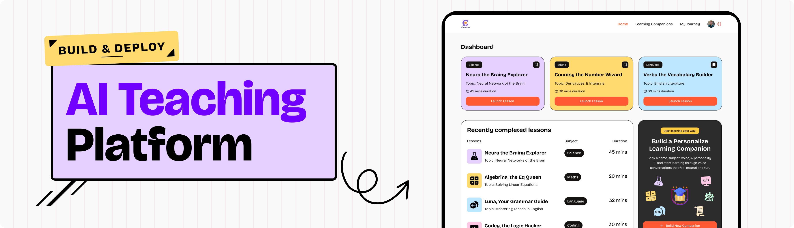

<div align="center">
  <br />
    <a href="https://www.youtube.com/watch?v=XUkNR-JfHwo" target="_blank">
      
    </a>
  <br />

  <div>
    
    
    
  </div>

  <h3 align="center">SaaS App - LMS with Next.js, Apollo Client (GraphQL) & Voice AI agents</h3>

   <div align="center">
     Credit Idea and UI/UX by <a href="https://www.youtube.com/watch?v=XUkNR-JfHwo" target="_blank"><b>JavaScript Mastery</b></a> YouTube. Join the JSM family!
    </div>
</div>

## 📋 <a name="table">Table of Contents</a>

1. 🤖 [Introduction](#introduction)
2. ⚙️ [Tech Stack](#tech-stack)
3. 🔋 [Features](#features)
4. 🤸 [Quick Start](#quick-start)

## <a name="introduction">🤖 Introduction</a>

Create an LMS SaaS app from scratch featuring user authentication, subscriptions, and payments using Next.js, Apollo Client (GraphQL). You'll build and deploy a real-time teaching platform with Vapi, integrate an AI vocal agent, and deliver seamless, interactive learning sessions.

## <a name="tech-stack">⚙️ Tech Stack</a>

- **[Clerk](https://jsm.dev/converso-clerk)** is a unified platform for authentication, user management, and billing. It offers embeddable UI components, flexible APIs, and admin dashboards for secure user management. Clerk also simplifies subscription management, allowing you to define plans, create pricing pages, and control access based on subscription tiers—all in one solution.

* **[Next.js](https://nextjs.org/)** is a powerful React framework that enables the development of fast, scalable web applications with features like server-side rendering, static site generation, and API routes for building full-stack applications.

* **[shadcn/ui](https://ui.shadcn.com/)** is a customizable component library built on Radix UI and Tailwind CSS. It offers a modern, accessible design system with pre-built components that are easy to theme and extend, making it ideal for building polished UIs with minimal effort.

- **[Apollo Client](https://www.apollographql.com/docs/react/)** is a popular state management and data-fetching library for JavaScript applications. It provides a powerful way to query, cache, and manage GraphQL data on the client side, offering features like normalized caching, optimistic UI updates, and seamless integration with frameworks such as React, Next.js, and Vue.

* **[Tailwind CSS](https://tailwindcss.com/)** is a utility-first CSS framework that allows developers to design custom user interfaces by applying low-level utility classes directly in HTML, streamlining the design process.
* **[TypeScript](https://www.typescriptlang.org/)** is a superset of JavaScript that adds static typing, providing better tooling, code quality, and error detection for developers, making it ideal for building large-scale applications.

- **[Vapi](https://jsm.dev/converso-vapi)** is a developer-centric voice AI platform that enables the creation of conversational voice agents with low-latency voice interactions, speech-to-text, and text-to-speech capabilities. It supports multilingual conversations, customizable voices, and seamless integration with various AI models and tools.

* **[Zod](https://zod.dev/)** is a TypeScript-first schema validation library that provides a simple and expressive way to define and validate data structures. Zod ensures data integrity by catching errors early during development.

## <a name="features">🔋 Features</a>

👉 **AI Voice Agents**: Take tutoring sessions with voiced AIs specializing in the topics you want to get better at.

👉 **Authentication**: Secure user sign-up and sign-in with Clerk; Google authentication and many more.

👉 **Billing & Subscriptions**: Easily manage plans, upgrades, and payment details.

👉 **Session History**: Let users organise their learning by bookmarking tutors and accessing previous sessions.

👉 **Code Reusability**: Leverage reusable components and a modular codebase for efficient development.

👉 **Create a Tutor**: Create your own AI tutors, choosing a subject, topic, and style of conversation.

👉 **Cross-Device Compatibility**: Fully responsive design that works seamlessly across all devices.

👉 **Database Integration**: Uses Supabase for real-time data handling and storage needs.

👉 **Modern UI/UX**: Clean, responsive design built with Tailwind CSS and shadcn/ui for a sleek user experience.

👉 **Scalable Tech Stack**: Built with Next.js for a fast, production-ready web application that scales seamlessly.

👉 **Search Functionality**: Find tutors quickly with robust filters and search bar.

and many more, including code architecture and reusability.

## <a name="quick-start">🤸 Quick Start</a>

Follow these steps to set up the project locally on your machine.

**Prerequisites**

Make sure you have the following installed on your machine:

- [Git](https://git-scm.com/)
- [Node.js](https://nodejs.org/en)
- [npm](https://www.npmjs.com/) (Node Package Manager)

**Cloning the Repository**

```bash
git clone https://github.com/wailwinaung-dev/lms-frontent.git
cd lms-frontent
```

**Installation**

Install the project dependencies using npm:

```bash
npm install
```

**Set Up Environment Variables**

Copy Environment File

```bash
cp .env.example .env.local
```

Change Environment Variable

```env
NEXT_PUBLIC_CLERK_PUBLISHABLE_KEY=your_clerk_publishable_key
CLERK_SECRET_KEY=your_clerk_secret_key

NEXT_PUBLIC_CLERK_SIGN_IN_URL=/sign-in
NEXT_PUBLIC_CLERK_SIGN_IN_FALLBACK_REDIRECT_URL=/
NEXT_PUBLIC_CLERK_SIGN_UP_FALLBACK_REDIRECT_URL=/

NEXT_PUBLIC_API_URL=http://localhost:3000/graphql

NEXT_PUBLIC_VAPI_TOKEN=your_vapi_token
```

Replace the placeholder values with your actual ImageKit, NeonDB, Upstash, and Resend credentials. You can obtain these credentials by signing up on: [Supabase](https://supabase.com/dashboard), [Clerk](https://jsm.dev/converso-clerk), [Sentry](https://jsm.dev/converso-sentry), [Vapi](https://jsm.dev/converso-vapi).

**Running the Project**

```bash
npm run dev
```

Open [http://localhost:3000](http://localhost:3000) in your browser to view the project.
